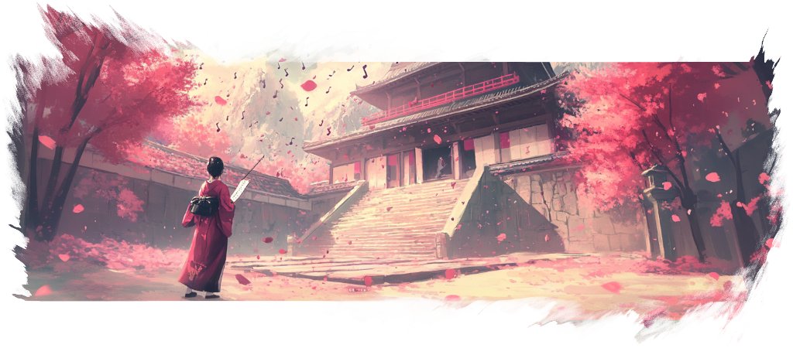

<!--
SPDX-FileCopyrightText: Simon Schneegans <code@simonschneegans.de>
SPDX-License-Identifier: CC-BY-4.0
-->

  

# Sound Themes for Kando

[Kando](https://github.com/kando-menu/kando) can use sound themes to make the menu even more fun to use.
This repository contains themes that you can use with Kando.
You can easily [create your own theme](https://kando.menu/create-sound-themes/)!
If you created something cool, feel free to share it with the community by opening a pull request.

To install a theme, simply download this repository and copy the directory of the theme you want to use into the `sound-themes` directory of your Kando installation.
Depending on your platform, the `sound-themes` directory is located at:

-  Windows: `%appdata%\kando\sound-themes\`
-  macOS: `~/Library/Application Support/kando/sound-themes/`
-  Linux: `~/.config/kando/sound-themes/`

For now, Kando does not have an option in the settings to change the sound theme.
To use the theme, you have to set it in the `config.json` file.
Where this is located, you can learn [here](https://kando.menu/config-files/)!

> [!TIP]
> You can also join the [Kando Discord server](https://discord.gg/hZwbVSDkhy) to share your themes and get help with creating them!

## 🎵 Available Themes

- [🎉 Example](./themes/example/): This is maybe not the most pleasing theme, but you can use it as a starting point to create your own themes!
- [🎉 EVNTech Vache](./themes/EVNTech-Vache/): This is a calm sound theme for pupils who love to stay focused and relaxed.
- [🎉 Synthetic Sound](./themes/Synthetic%20sound/): A futuristic synthetic sound theme with carefully balanced audio effects by Rena and LCG.
